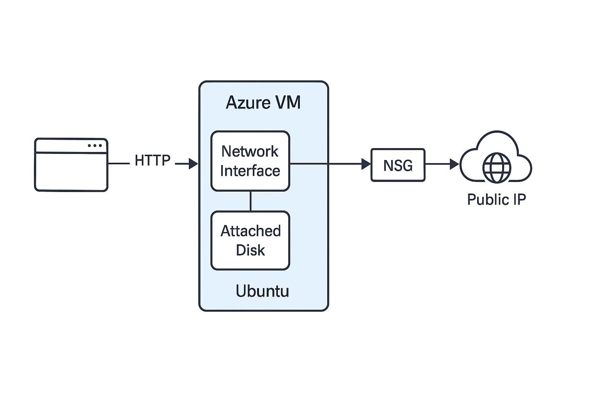
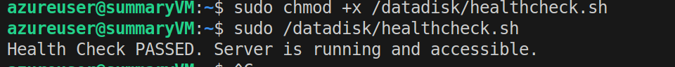
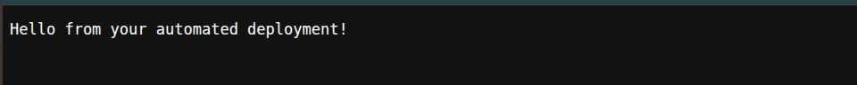

# WEEK 8 SUMMARY: Azure Infrastructure Deployment

This document details the steps to provision an Azure VM, configure its network, and deploy a simple web application using the Azure CLI.




## Provision a Linux-based Azure VM

First, we need to log in to our Azure account.

```bash
az login
```

Next, we create a resource group to hold all our Azure resources. A resource group is a container that holds related resources for an Azure solution.

```bash
# Define variables for our deployment
RESOURCE_GROUP="DevOpsSummaryRG"
LOCATION="northeurope"

az group create --name $RESOURCE_GROUP --location $LOCATION
```

Now, we will create the Linux-based virtual machine.

```bash
# Define VM-specific variables
VM_NAME="summaryVM"
ADMIN_USERNAME="azureuser"
VM_IMAGE="Ubuntu2204"

az vm create \
    --resource-group $RESOURCE_GROUP \
    --name $VM_NAME \
    --image $VM_IMAGE \
    --admin-username $ADMIN_USERNAME \
    --generate-ssh-keys
```

### Explanation of Commands:

*   `az login`: Initiates the Azure login process in your browser.
*   `az group create`: Creates a new resource group.
    *   `--name`: Specifies the name for the resource group (`DevOpsSummaryRG`).
    *   `--location`: Sets the Azure region for the resources (`northeurope`).
*   `az vm create`: Provisions a new virtual machine.
    *   `--resource-group`: Assigns the VM to our `DevOpsSummaryRG` group.
    *   `--name`: Sets the name of the VM to `summaryVM`.
    *   `--image`: Specifies the OS image, in this case, `Ubuntu2204`.
    *   `--admin-username`: Creates the initial user account on the VM.
    *   `--generate-ssh-keys`: Automatically creates and configures SSH keys for secure access.

We have provisioned a new Linux VM in Azure.

## Configure Network Security Group (NSG) for HTTP Access

To allow web traffic to our VM, we need to open port 80 (the standard port for HTTP).

```bash
az vm open-port --port 80 --resource-group $RESOURCE_GROUP --name $VM_NAME --priority 900
```

### Explanation of Command:

*   `az vm open-port`: Creates a network security group (NSG) rule to allow traffic.
    *   `--port`: The port to open (`80`).
    *   `--resource-group`: The resource group of the VM.
    *   `--name`: The name of the VM.
    *   `--priority`: A number between 100 and 4096 to determine the rule's priority. Lower numbers are processed first.


## Assign a Static Public IP

By default, the public IP address assigned to a VM is dynamic and may change if the VM is stopped and restarted. For a web server, we need a static IP that does not change.

First, we need to find the name of the public IP resource associated with our VM.

```bash
# Find the Public IP name
PUBLIC_IP_NAME=$(az vm list-ip-addresses -g $RESOURCE_GROUP -n $VM_NAME --query "[0].virtualMachine.network.publicIpAddresses[0].name" -o tsv)

echo "Public IP Name: $PUBLIC_IP_NAME"
```

Now, we update the public IP to be static.

```bash
# Set the IP to static
az network public-ip update --resource-group $RESOURCE_GROUP --name $PUBLIC_IP_NAME --allocation-method Static
```

### Explanation of Commands:

*   `az vm list-ip-addresses`: Retrieves the IP addresses associated with a VM. We query this output to get the name of the public IP resource.
*   `az network public-ip update`: Modifies the public IP resource.
    *   `--allocation-method Static`: Changes the IP allocation from dynamic to static.


## Attach a Persistent Data Disk

For persistent data storage, we will attach a new managed disk to the VM. This disk will persist independently of the VM's lifecycle.

First, we create a new managed disk.

```bash
# Create a new data disk
az vm disk attach --resource-group $RESOURCE_GROUP --vm-name $VM_NAME --name data-disk --new --size-gb 10 --sku Standard_LRS
```

### Explanation of Command:

*   `az vm disk attach`: Creates and attaches a new managed disk to a VM.
    *   `--resource-group`: The resource group of the VM.
    *   `--vm-name`: The name of the VM to attach the disk to.
    *   `--name`: The name for the new disk (`data-disk`).
    *   `--new`: Indicates that a new disk should be created.
    *   `--size-gb`: The size of the new disk in gigabytes (`10`).
    *   `--sku`: The performance SKU for the disk (`Standard_LRS` for standard locally-redundant storage).

### Note: When to Use a Disk vs. Storage Account

*   **Use an Azure Disk (like we did here)** when you need storage that acts like a traditional hard drive for your VM. It is ideal for the operating system, applications, and databases that require high-performance block storage.
*   **Use an Azure Storage Account** when you need a centralized, network-accessible place to store files, backups, or large amounts of unstructured data (like images or logs). It is better suited for scenarios where data needs to be accessed from multiple locations or services.

After attaching the disk, you would typically need to connect to the VM via SSH to partition, format, and mount the new disk. Those steps are performed within the VM's operating system.


## Prepare and Mount the Data Disk

After attaching the disk, we need to connect to the VM via SSH to partition, format, and mount it.

### Step 1: Connect to the VM

First, get the public IP address of the VM.

```bash
PUBLIC_IP=$(az vm list-ip-addresses -g $RESOURCE_GROUP -n $VM_NAME --query "[0].virtualMachine.network.publicIpAddresses[0].ipAddress" -o tsv)
echo "Connecting to VM at: $PUBLIC_IP"
```

Now, use the IP address to SSH into the VM.

```bash
ssh azureuser@$PUBLIC_IP
```

### Step 2: Partition and Format the Disk (Inside the VM)

Once connected to the VM, run the following commands to find the new disk, partition it, and format it.

First, find the disk device name. Run the following command and look for the disk that matches the size you created (e.g., 10G) and does not have a mount point. It is usually `/dev/sdc`.

```bash
lsblk -o NAME,SIZE,MOUNTPOINT
```

Now, partition the disk using `parted`. Make sure to replace `/dev/sdc` if your disk has a different name.

```bash
sudo parted /dev/sdc --script mklabel gpt mkpart xfspart 0% 100%
```

Format the new partition with the `xfs` filesystem.

```bash
sudo mkfs.xfs /dev/sdc1
```

### Mount the Disk and Configure fstab (Inside the VM)

Create a directory to mount the new disk and then mount it.

```bash
sudo mkdir /datadisk
sudo mount /dev/sdc1 /datadisk
```

Finally, add an entry to `/etc/fstab` to make sure the disk is automatically mounted after a reboot.

First, get the UUID of the new partition.

```bash
sudo blkid
```

Copy the UUID for `/dev/sdc1` and add it to `/etc/fstab`.

```bash
# Add the UUID to /etc/fstab to make the mount persistent
sudo sh -c 'echo "UUID=dd90ca68-5256-47f1-acb4-9557b24b945d /datadisk xfs defaults,nofail 1 2" >> /etc/fstab'
```


## Deploy a Simple Web Application

Now we will install Node.js and run a simple web server on our VM.

### Step 1: Install Node.js and npm (Inside the VM)

First, we need to update the package lists and install Node.js.

```bash
sudo apt update
sudo apt install -y nodejs npm
```

### Step 2: Create the Web Server Application (Inside the VM)

Next, we will create a simple Node.js application file named `server.js`. This server will listen on port 80 and respond with "Hello World!".

```bash
cat <<EOF | sudo tee /datadisk/server.js
const http = require('http');

const server = http.createServer((req, res) => {
  res.statusCode = 200;
  res.setHeader('Content-Type', 'text/plain');
  res.end('Hello World!\\n');
});

server.listen(80, '0.0.0.0', () => {
  console.log('Server running at http://0.0.0.0:80/');
});
EOF
```

### Step 3: Run the Web Server (Inside the VM)

Now, we will run the server. We will use `sudo` because we are listening on port 80, which is a privileged port. We will use `nohup` and `&` to run the server in the background so it keeps running even after we disconnect from the SSH session.

```bash
sudo nohup node /datadisk/server.js &
```

```bash
exit
```

### Step 4: Verify the Application

You can now access your web application by navigating to your VM's public IP address in a web browser. You should see the message "Hello World!".

To get your public IP, you can run this command again in your local terminal:

```bash
PUBLIC_IP=$(az vm list-ip-addresses -g $RESOURCE_GROUP -n $VM_NAME --query "[0].virtualMachine.network.publicIpAddresses[0].ipAddress" -o tsv)
echo $PUBLIC_IP
```

## Health Check Integration

A health check script is a simple way to programmatically verify that our application is running correctly. This script will use `curl` to make a request to the local web server and check if it receives the expected "Hello World!" response.

### Step 1: Create the Health Check Script (Inside the VM)

Connect back to your VM using `ssh azureuser@<YOUR_PUBLIC_IP>` if you have disconnected.

Create a new file named `healthcheck.sh` in the `/datadisk` directory.

```bash
cat <<'EOF' | sudo tee /datadisk/healthcheck.sh
#!/bin/bash

# Use curl to get the HTTP status code
STATUS_CODE=$(curl --output /dev/null --silent --write-out "%{http_code}" http://localhost)

# Check if the status code is 200
if [ "$STATUS_CODE" -eq 200 ]; then
  echo "Health Check PASSED. Server is running and accessible."
  exit 0
else
  echo "Health Check FAILED. Server returned status code $STATUS_CODE."
  exit 1
fi
EOF
```

### Step 2: Make the Script Executable (Inside the VM)

We need to give the script execute permissions.

```bash
sudo chmod +x /datadisk/healthcheck.sh
```

### Step 3: Run the Health Check (Inside the VM)

Now, run the script to check the status of your web server.

```bash
sudo /datadisk/healthcheck.sh
```




## Automated Deployment Script

To streamline the entire setup and teardown process, an automated deployment script, [`deploy_summary.sh`](deploy_summary.sh), has been created.

### How to Use the Script

The script is designed to be run from your local machine and handles all the steps documented above. It accepts two main commands: `deploy` and `cleanup`.

#### To Deploy the Infrastructure:

Run the following command to create all the Azure resources and deploy the web application:

```bash
./deploy_summary.sh deploy
```

Upon successful completion, the script will output the public IP address of the new VM:

```text
Deployment successful!
You can access your web app at: http://<PUBLIC_IP>
```

Navigating to this IP address in your web browser will display the application's welcome message:



#### To Clean Up Resources:

To delete the entire resource group and all associated resources, run the `cleanup` command. This is useful for avoiding unnecessary costs when the environment is not in use.

```bash
./deploy_summary.sh cleanup
```

