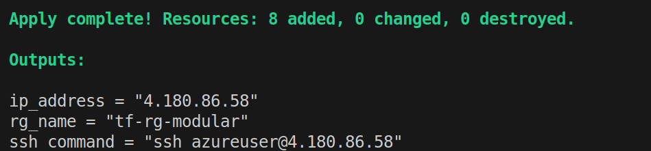
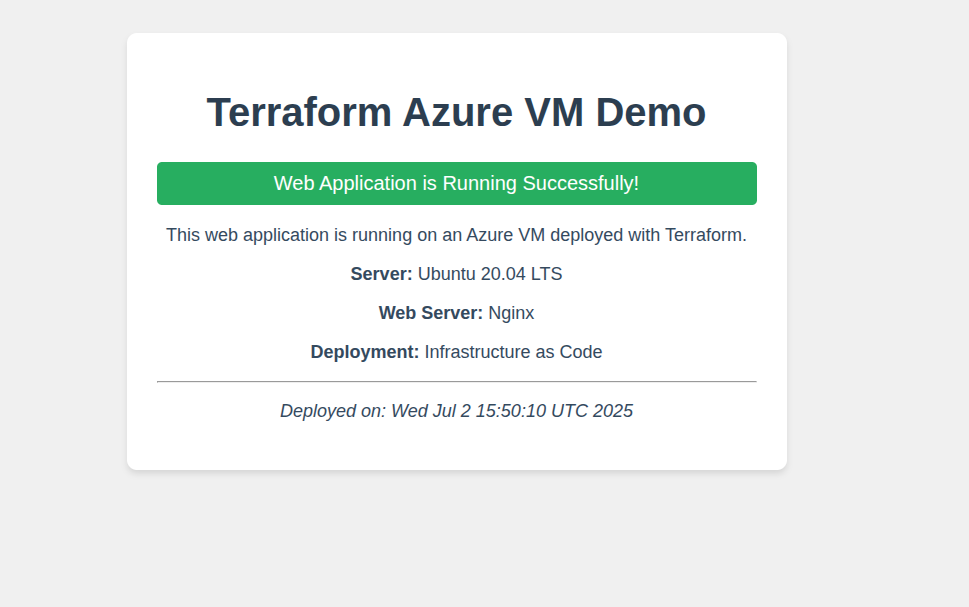

# Terraform on Azure 

## What is Terraform?
Terraform is an Infrastructure as Code (IaC) tool that allows you to define and provision infrastructure using declarative configuration files. Instead of manually creating resources through the Azure Portal, we write code that describes our desired infrastructure state.

**Important Note**: 
Terraform does not run regular programming code, but rather declares:
"This is what I want to be in the end" (to request a certain group of resources).
It is responsible for comparing the existing situation in reality with what you have defined, and making changes only if necessary.

After downloading Terraform from the official download site, we can verify the installation with:
```bash
terraform -v
```
Next, configure your system for working with Azure using `az login` and ensure your CLI is connected to the correct Azure subscription. 


## Terraform Configuration
Every Terraform project starts with `main.tf`. This is the place where we start to define our resources in Azure. 

In the `main.tf` file, we declare our provider. 
Providers are plugins that translate Terraform code into API calls to cloud services.

In this example, we use `azurerm` – The main provider for deploying resources in Azure.


```hcl
terraform {
  required_providers {
    azurerm = {
      source  = "hashicorp/azurerm"
      version = "~> 3.0"
    }
  }
}
```
- The `terraform` block specifies which providers we need
- `azurerm` is the Azure Resource Manager provider that allows Terraform to interact with Azure
- Version constraint `~>3.0` ensures we use version 3.x but allows minor updates for bug fixes
- This prevents breaking changes from major version updates

### Provider Features
```hcl
provider "azurerm" {
  features {}
}
```

- The `provider` block configures the Azure provider
- `features {}` enables default Azure provider features
- This block is required even if empty - it tells Terraform how to authenticate with Azure
- Uses Azure CLI credentials automatically if you're logged in via `az login`

### Resource Group Definition
```hcl
resource "azurerm_resource_group" "main" {
  name = "tf-rg"
  location = "West Europe"  

  tags = {
    Environment = "Development"
    Project     = "Terraform-Demo"
    CreatedBy   = "Terraform"
  }
}
```

- **Resource Groups**: Azure's way of organizing related resources
- **Naming**: You must provide a unique name value here
- **Location**: Specifies the Azure region where resources will be deployed - you must provide a value here
- **Tags**: Metadata for organization, cost tracking, and automation
  - `Environment`: Helps distinguish dev/staging/prod resources
  - `Project`: Groups resources by project for billing and management
  - `CreatedBy`: Tracks how the resource was created


### Terraform Workflow Commands

#### 1. Initialize Terraform
```bash
terraform init
```
**What this does:**
- Downloads the Azure provider plugin
- Initializes the working directory
- Creates `.terraform` directory with provider binaries
- Sets up the backend for state management

**Why it's important:**
- Must be run before any other Terraform commands
- Downloads specific provider versions based on configuration
- Prepares Terraform to manage your infrastructure

#### 2. Plan the Deployment
```bash
terraform plan
```
**What this does:**
- Analyzes your configuration files
- Compares desired state with current state
- Shows what changes will be made
- Validates configuration syntax

**Why it's important:**
- **Safety**: Preview changes before applying them
- **Validation**: Catches configuration errors early
- **Documentation**: Shows exactly what will be created/modified/destroyed
- **Best Practice**: Always plan before apply

#### 3. Apply the Configuration
```bash
terraform apply
```
**What this does:**
- Executes the planned changes
- Creates the Azure resource group
- Updates Terraform state file
- Shows outputs after successful deployment

**Why it's important:**
- **Deployment**: Actually creates the infrastructure
- **State Management**: Tracks what Terraform manages
- **Idempotency**: Can be run multiple times safely

#### 4. Verify Deployment
```bash
# Check outputs
terraform output

# List resources in state
terraform state list

# Show detailed resource information
terraform show
```

## Define and Deploy a Virtual Machine

A VM in Azure doesn't stand alone – it depends on the infrastructure around it:
🔌 Network, 🌐 IP address, 🔒 Rules (NSG), etc. Terraform requires you to explicitly configure each of these.

Before we start creating the resources we need for the VM, we'll start by creating a 
`variables.tf` file to declare every variable.
We just need to remember: 
Terraform doesn't care about the file names themselves (like variables.tf, main.tf, outputs.tf) – it simply loads all the files in the folder that end in .tf, as if they were one huge file.
Terraform simply loads them all during `terraform init` and `apply`, regardless of the file name.


```hcl
variable "location" {
    description = "Azure region for the resources"
    type        = string
    default     = "West Europe"
}

variable "vm_name" {
    description = "Name of the virtual machine"
    type        = string
    default     = "vm-demo"
  
}

variable "admin_username" {
    description = "Admin username for the VM"
    type        = string
    default     = "azureuser"
}

variable "admin_password" {
    description = "Admin password for the VM"
    type        = string
    sensitive   = true
    default     = "TerraformDemo123"
}
```

Now we can move to the necessary resources to create the VM: 

```hcl
# Create a virtual network
resource "azurerm_virtual_network" "main" {
  name                = "vnet-${var.vm_name}"
  address_space       = ["10.0.0.0/16"]
  location            = azurerm_resource_group.main.location
  resource_group_name = azurerm_resource_group.main.name
}

# Create a subnet
resource "azurerm_subnet" "main" {
  name                 = "subnet-${var.vm_name}"
  resource_group_name  = azurerm_resource_group.main.name
  virtual_network_name = azurerm_virtual_network.main.name
  address_prefixes     = ["10.0.1.0/24"]
}


# Create a public IP
resource "azurerm_public_ip" "main" {
  name                = "pip-${var.vm_name}"
  location            = azurerm_resource_group.main.location
  resource_group_name = azurerm_resource_group.main.name
  allocation_method   = "Static"
}

# Create Network Security Group with SSH rule
resource "azurerm_network_security_group" "main" {
  name                = "nsg-${var.vm_name}"
  location            = azurerm_resource_group.main.location
  resource_group_name = azurerm_resource_group.main.name

  security_rule {
    name                       = "SSH"
    priority                   = 1001
    direction                  = "Inbound"
    access                     = "Allow"
    protocol                   = "Tcp"
    source_port_range          = "*"
    destination_port_range     = "22"
    source_address_prefix      = "*"
    destination_address_prefix = "*"
  }
}

# Create network interface
resource "azurerm_network_interface" "main" {
  name                = "nic-${var.vm_name}"
  location            = azurerm_resource_group.main.location
  resource_group_name = azurerm_resource_group.main.name

  ip_configuration {
    name                          = "internal"
    subnet_id                     = azurerm_subnet.main.id
    private_ip_address_allocation = "Dynamic"
    public_ip_address_id          = azurerm_public_ip.main.id
  }
}

# Associate Network Security Group to Network Interface
resource "azurerm_network_interface_security_group_association" "main" {
  network_interface_id      = azurerm_network_interface.main.id
  network_security_group_id = azurerm_network_security_group.main.id
}

# Create virtual machine
resource "azurerm_linux_virtual_machine" "main" {
  name                = var.vm_name
  location            = azurerm_resource_group.main.location
  resource_group_name = azurerm_resource_group.main.name
  size                = "Standard_B1s"
  admin_username      = var.admin_username
  admin_password      = var.admin_password

  disable_password_authentication = false

  network_interface_ids = [
    azurerm_network_interface.main.id,
  ]

  os_disk {
    caching              = "ReadWrite"
    storage_account_type = "Standard_LRS"
  }

  source_image_reference {
    publisher = "Canonical"
    offer     = "0001-com-ubuntu-server-focal"
    sku       = "20_04-lts-gen2"
    version   = "latest"
  }
}
```

## Organize Terraform Code with Modules
A module in Terraform is simply a folder that contains .tf files (usually main.tf, variables.tf, outputs.tf) and represents an independent component of the infrastructure (such as a network, VM, group of resources).

```bash
├── main.tf
├── variables.tf
├── outputs.tf
└── modules/
    ├── resource_group/
    │   ├── main.tf
    │   ├── variables.tf
    │   └── outputs.tf
    ├── network/
    │   └── ...
    └── vm/
        └── ..
```

And in the root `main.tf`, we can call them more cleanly:
```bash
# Configure the Azure Provider
terraform {
  required_providers {
    azurerm = {
      source  = "hashicorp/azurerm"
      version = "~> 3.0"
    }
  }
}

# Configure the Microsoft Azure Provider
provider "azurerm" {
  features {}
}

module "resource_group" {
  source = "./modules/resource-group"
  name     = var.resource_group_name
  location = var.location
}

module "network" {
  source = "./modules/network"
  resource_group_name = module.resource_group.name
  location            = module.resource_group.location
  vm_name             = var.vm_name  
}


module "vm" {
  source = "./modules/vm"
  resource_group_name   = module.resource_group.name
  location              = module.resource_group.location
  vm_name               = var.vm_name
  admin_username        = var.admin_username
  admin_password        = var.admin_password
  network_interface_id  = module.network.network_interface_id
}
```


## Remote State with Azure Storage (with Logging & Debugging)

### What is state?
Terraform stores the real state of resources in the `terraform.tfstate` file.
This file is the heart of everything: it knows which resources have already been created, what their names are, what their IDs are, and what is different from the definitions in the code.

If you delete the file – Terraform will not know whether a resource exists or not.

🚨 **Problem**: Local state file = danger
- Not secure (very sensitive – contains passwords, keys, etc.)
- Not suitable for teams (sharing will cause conflicts)
- Not accessible from CI/CD or cloud environments

Therefore, the solution is Remote Backend – we will use Azure Storage to store the file in the cloud.

### Create Azure RG + Storage Account + Container
```bash
az group create --name terraform-state-rg --location westeurope

az storage account create \
  --name mystatestorage779 \
  --resource-group terraform-state-rg \
  --location westeurope \
  --sku Standard_LRS


az storage container create \
  --name tfstate \
  --account-name mystatestorage779  
```

Next, we define `backend.tf`:
```hcl 
terraform {
  backend "azurerm" {
    resource_group_name   = "terraform-state-rg"
    storage_account_name  = "mystatestorage779"
    container_name        = "tfstate"
    key                   = "terraform.tfstate"
  }
}
```
Once `terraform init` has run, the state will have moved to Azure.

### Application Health Monitoring
```bash
./healthcheck.sh 4.180.86.58
Web app is accessible at 4.180.86.58
```
webapp on vm
```bash
./setup-webapp.sh 4.180.86.58 TerraformDemo123
```

## Automatic Deployment

We can automate the process by creating a bash script
```bash 
chmod +x deploy.sh
./deploy.sh
```







### Reboot the VM Using Azure CLI
```bash
az vm restart \
  --name vm-demo \
  --resource-group tf-rg-modular
```

## Advanced Practice: Import and Cleanup

**What is terraform import?**
This is a command that allows you to connect an existing resource in the real world (in the cloud) to the Terraform state.
In other words, it tells Terraform:

"This resource already exists, attach it to your state and start managing it"

```bash 
az group create \
  --name manual-import-rg \
  --location westeurope
```


```bash
terraform import azurerm_resource_group.manual /subscriptions/<SUB_ID>/resourceGroups/manual-import-rg
```

Next, we can verify by seeing `azurerm_resource_group.manual` when we run:
```bash
terraform state list
```

We finish by cleaning up all resources:
```bash
terraform destroy
```
